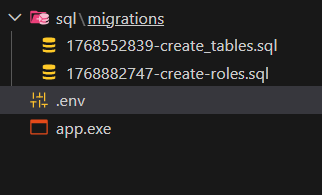

# msql (migrate-psql)

- Softwere Requirements
    1) Need golang
    2) postgresql

With this you can create migration query and migrate psql commands

```bash
PROJECT STRUCTURE 
```
```
msql/
│
├── cmd/
│   ├── sqlrunner/
│   │    └── cmd.go  
│   └── app.go  
│
├── internal/
│   └── database/
│       ├── postgres.go  
│       └── models.go
│ 
├── sql/
│   └── migrations/
│       ├── 001_create_tables.sql
│       └── 002_add_indexes.sql
│
├── .gitignore
├── .env
├── go.mod
└── go.sum
```

## How to use

Create sql migration file
```bash
 go run cmd/app.go -file <file_name> -gen
```
Run sql migration file to create
```bash
 go run cmd/app.go -file <file_name> -create
```   
Run sql migration file to drop
```bash
 go run cmd/app.go -file <file_name> -drop
```  

Run sql bulk migration file to create/drop

```bash
Create
 go run cmd/app.go -all -create
```
```bash
Drop
 go run cmd/app.go -all -drop
```

To Run it without any code You can use the procedure below
```bash
CREATE EXE FILE & EXECUTE
```
 1) ####  Create OS supported execution file
    ```
    WINDOWS
    go build -o app.exe ./cmd/app

    LINUX/MAC
    go build -o app ./cmd/app
    ```
 2) ####  Run the previous commands without "go run cmd/app.go" this part
      ```bash
      ./app.exe <command>
      Example : To create file -> ./app.exe -file create-roles -gen
      ```
 Now you can run this with only this 
 

create a .env file add the contents below
```bash
DB_HOST=localhost
DB_PORT=5432
DB_USER=dbuser
DB_PASSWORD=dbpass
DB_NAME=mydb
DB_SSLMODE=disable
DB_SCHEMA=test

```

## Authors
DEBOJYOTI CHAKRABORTY
- GitHub : [@deb151292](https://github.com/deb151292)
- Email : [deb151292@gmail.com](deb151292@gmail.com)

Please feel free to contact me for any queries.